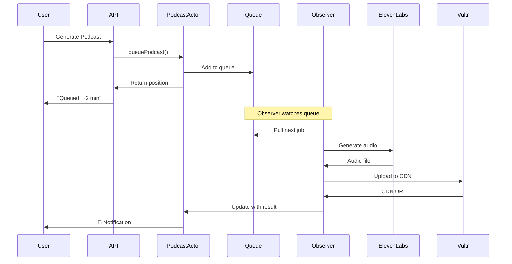

# Podcast Generation Queue - Implementation Guide

**Priority 1: Transform podcast generation from blocking to async**

---

## Before vs After

### **Current Experience (Blocking)**
```
User clicks "Generate Podcast"
  ↓
[Loading spinner for 30-60 seconds] 😴
  ↓
Podcast ready OR error
```

### **New Experience (Async + Actor)**
```
User clicks "Generate Podcast"
  ↓
"Queued! Position #2 (~2 min)" ⚡
  ↓
User continues browsing
  ↓
🔔 "Your daily brief is ready!"
```

---

## Architecture



---

## Step-by-Step Implementation

### **Step 1: Update raindrop.manifest**

Add actors, queues, and observers:

```hcl
application "hakivo" {

  # Existing components...

  # Podcast generation queue
  queue "podcast-generation-queue" {
    # Optional: Configure queue settings
    # max_retries = 3
    # visibility_timeout = 300  # 5 minutes
  }

  # Actor to manage user's podcast queue
  actor "podcast-generator" {
    # Raindrop will auto-generate the TypeScript class
  }

  # Observer to process podcast jobs
  observer "podcast-queue-handler" {
    source {
      queue = "podcast-generation-queue"
    }
  }
}
```

### **Step 2: Generate Scaffolding**

```bash
raindrop build generate
```

This creates:
- `src/actors/podcast-generator/index.ts`
- `src/observers/podcast-queue-handler/index.ts`
- Type definitions in `src/raindrop.gen.ts`

### **Step 3: Implement Podcast Generator Actor**

`src/actors/podcast-generator/index.ts`

```typescript
import { Actor, ActorState } from '@liquidmetal-ai/raindrop-framework';
import { Env } from '../../raindrop.gen';

interface PodcastRequest {
  id: string;
  type: 'daily' | 'weekly';
  bills: string[];
  timestamp: number;
  userId: string;
}

interface GenerationStatus {
  podcastId: string;
  status: 'queued' | 'processing' | 'completed' | 'failed';
  queuePosition?: number;
  startedAt?: number;
  completedAt?: number;
  audioUrl?: string;
  error?: string;
}

export default class PodcastGenerator extends Actor<Env> {
  constructor(state: ActorState, env: Env) {
    super(state, env);
  }

  /**
   * Queue a new podcast generation request
   */
  async queuePodcast(request: Omit<PodcastRequest, 'id' | 'timestamp'>): Promise<number> {
    const podcastId = `podcast-${Date.now()}-${Math.random().toString(36).substr(2, 9)}`;

    const fullRequest: PodcastRequest = {
      ...request,
      id: podcastId,
      timestamp: Date.now()
    };

    // Get current queue
    const queue = await this.state.storage.get<PodcastRequest[]>('queue') || [];

    // Add to queue
    queue.push(fullRequest);
    await this.state.storage.put('queue', queue);

    // Add to status tracker
    const status: GenerationStatus = {
      podcastId,
      status: 'queued',
      queuePosition: queue.length
    };
    await this.state.storage.put(`status:${podcastId}`, status);

    // Send to processing queue
    await this.env.PODCAST_GENERATION_QUEUE.send({
      ...fullRequest,
      actorId: this.state.id.toString()
    });

    console.log(`Queued podcast ${podcastId} at position ${queue.length}`);

    return queue.length;
  }

  /**
   * Get status of a podcast generation
   */
  async getStatus(podcastId: string): Promise<GenerationStatus | null> {
    return await this.state.storage.get<GenerationStatus>(`status:${podcastId}`) || null;
  }

  /**
   * Get current queue
   */
  async getQueue(): Promise<PodcastRequest[]> {
    return await this.state.storage.get<PodcastRequest[]>('queue') || [];
  }

  /**
   * Get generation history (last 10)
   */
  async getHistory(): Promise<GenerationStatus[]> {
    const history = await this.state.storage.get<GenerationStatus[]>('history') || [];
    return history.slice(0, 10);
  }

  /**
   * Update status when generation completes
   */
  async updateStatus(podcastId: string, updates: Partial<GenerationStatus>): Promise<void> {
    const status = await this.state.storage.get<GenerationStatus>(`status:${podcastId}`);
    if (!status) {
      console.error(`Status not found for podcast ${podcastId}`);
      return;
    }

    const updatedStatus = { ...status, ...updates };
    await this.state.storage.put(`status:${podcastId}`, updatedStatus);

    // If completed, add to history
    if (updatedStatus.status === 'completed' || updatedStatus.status === 'failed') {
      const history = await this.state.storage.get<GenerationStatus[]>('history') || [];
      history.unshift(updatedStatus);
      await this.state.storage.put('history', history.slice(0, 10)); // Keep last 10

      // Remove from queue
      const queue = await this.state.storage.get<PodcastRequest[]>('queue') || [];
      const filteredQueue = queue.filter(r => r.id !== podcastId);
      await this.state.storage.put('queue', filteredQueue);
    }

    console.log(`Updated status for podcast ${podcastId}:`, updatedStatus.status);
  }

  /**
   * Cancel a queued podcast
   */
  async cancel(podcastId: string): Promise<boolean> {
    const status = await this.state.storage.get<GenerationStatus>(`status:${podcastId}`);

    if (!status || status.status !== 'queued') {
      return false;
    }

    // Remove from queue
    const queue = await this.state.storage.get<PodcastRequest[]>('queue') || [];
    const filteredQueue = queue.filter(r => r.id !== podcastId);
    await this.state.storage.put('queue', filteredQueue);

    // Update status
    await this.updateStatus(podcastId, {
      status: 'failed',
      error: 'Cancelled by user',
      completedAt: Date.now()
    });

    return true;
  }
}
```

### **Step 4: Implement Queue Observer**

`src/observers/podcast-queue-handler/index.ts`

```typescript
import { Each, Message } from '@liquidmetal-ai/raindrop-framework';
import { Env } from '../../raindrop.gen';
import { generatePodcastDialogue } from '../../lib/ai/podcast-generation';
import { generateDialogueAudio } from '../../lib/ai/elevenlabs';
import { uploadToVultr } from '../../lib/storage/vultr';

interface PodcastJob {
  id: string;
  type: 'daily' | 'weekly';
  bills: string[];
  userId: string;
  actorId: string;
  timestamp: number;
}

export default class PodcastQueueHandler extends Each<PodcastJob, Env> {

  async process(message: Message<PodcastJob>): Promise<void> {
    const job = message.body;

    console.log(`Processing podcast job ${job.id}`);

    try {
      // Get actor to update status
      const actorId = this.env.PODCAST_GENERATOR.idFromString(job.actorId);
      const actor = this.env.PODCAST_GENERATOR.get(actorId);

      // Update to processing
      await actor.updateStatus(job.id, {
        status: 'processing',
        startedAt: Date.now()
      });

      // Step 1: Fetch bill data
      const bills = await this.fetchBills(job.bills);

      // Step 2: Generate dialogue script
      console.log(`Generating dialogue for ${job.id}`);
      const dialogue = await generatePodcastDialogue(bills, job.type);

      // Step 3: Generate audio (ElevenLabs text-to-dialogue)
      console.log(`Generating audio for ${job.id}`);
      const audioBuffer = await generateDialogueAudio(dialogue);

      // Step 4: Upload to Vultr CDN
      console.log(`Uploading audio for ${job.id}`);
      const audioUrl = await uploadToVultr(audioBuffer, {
        key: `podcasts/${job.userId}/${job.id}.mp3`,
        contentType: 'audio/mpeg'
      });

      // Step 5: Update actor with success
      await actor.updateStatus(job.id, {
        status: 'completed',
        audioUrl,
        completedAt: Date.now()
      });

      // Step 6: Send notification (optional - via another queue/service)
      await this.env.USER_NOTIFICATIONS.send({
        userId: job.userId,
        type: 'podcast_ready',
        podcastId: job.id,
        audioUrl
      });

      // Acknowledge successful processing
      message.ack();

      console.log(`✅ Completed podcast ${job.id}`);

    } catch (error: any) {
      console.error(`❌ Failed to generate podcast ${job.id}:`, error);

      // Update actor with failure
      try {
        const actorId = this.env.PODCAST_GENERATOR.idFromString(job.actorId);
        const actor = this.env.PODCAST_GENERATOR.get(actorId);

        await actor.updateStatus(job.id, {
          status: 'failed',
          error: error.message,
          completedAt: Date.now()
        });
      } catch (updateError) {
        console.error('Failed to update actor status:', updateError);
      }

      // Retry with exponential backoff
      if (message.attempts < 3) {
        const delaySeconds = Math.pow(2, message.attempts) * 60; // 1min, 2min, 4min
        message.retry({ delaySeconds });
        console.log(`Retrying in ${delaySeconds}s (attempt ${message.attempts + 1}/3)`);
      } else {
        // Max retries exceeded - acknowledge to prevent infinite loop
        message.ack();
        console.error(`Max retries exceeded for podcast ${job.id}`);
      }
    }
  }

  private async fetchBills(billIds: string[]) {
    // Fetch from SmartSQL
    const bills = [];
    for (const billId of billIds) {
      const result = await this.env.SMART_SQL.execute({
        query: 'SELECT * FROM bills WHERE id = ?',
        params: [billId]
      });
      if (result.rows.length > 0) {
        bills.push(result.rows[0]);
      }
    }
    return bills;
  }
}
```

### **Step 5: Update API Route**

`app/api/podcasts/generate/route.ts`

```typescript
import { NextRequest, NextResponse } from 'next/server';
import { getSession } from '@/lib/auth';

export async function POST(req: NextRequest) {
  try {
    const session = await getSession(req);
    if (!session) {
      return NextResponse.json({ error: 'Unauthorized' }, { status: 401 });
    }

    const { type, bills } = await req.json();

    // Get user's podcast generator actor
    const actorId = env.PODCAST_GENERATOR.idFromName(session.user.id);
    const actor = env.PODCAST_GENERATOR.get(actorId);

    // Queue the podcast (non-blocking!)
    const queuePosition = await actor.queuePodcast({
      type,
      bills,
      userId: session.user.id
    });

    // Calculate estimated time (45 seconds per podcast in queue)
    const estimatedSeconds = queuePosition * 45;
    const estimatedMinutes = Math.ceil(estimatedSeconds / 60);

    return NextResponse.json({
      success: true,
      queued: true,
      queuePosition,
      estimatedTime: {
        seconds: estimatedSeconds,
        humanReadable: `~${estimatedMinutes} minute${estimatedMinutes > 1 ? 's' : ''}`
      },
      message: queuePosition === 1
        ? 'Generating your podcast now...'
        : `Queued! Position #${queuePosition}`
    });

  } catch (error: any) {
    console.error('Podcast queue error:', error);
    return NextResponse.json(
      { error: 'Failed to queue podcast', details: error.message },
      { status: 500 }
    );
  }
}
```

### **Step 6: Update Frontend**

`components/podcast-generator.tsx`

```typescript
'use client';

import { useState, useEffect } from 'react';
import { Button } from '@/components/ui/button';

export function PodcastGenerator({ bills }: { bills: string[] }) {
  const [status, setStatus] = useState<'idle' | 'queued' | 'processing' | 'ready'>('idle');
  const [queueInfo, setQueueInfo] = useState<any>(null);

  async function handleGenerate() {
    const response = await fetch('/api/podcasts/generate', {
      method: 'POST',
      headers: { 'Content-Type': 'application/json' },
      body: JSON.stringify({ type: 'daily', bills })
    });

    const data = await response.json();

    if (data.success) {
      setStatus('queued');
      setQueueInfo(data);

      // Poll for status updates
      pollStatus();
    }
  }

  async function pollStatus() {
    const interval = setInterval(async () => {
      const response = await fetch('/api/podcasts/status');
      const data = await response.json();

      if (data.status === 'completed') {
        setStatus('ready');
        clearInterval(interval);

        // Show notification
        new Notification('Your podcast is ready! 🎧');
      } else if (data.status === 'processing') {
        setStatus('processing');
      }
    }, 5000); // Poll every 5 seconds

    // Clean up after 10 minutes
    setTimeout(() => clearInterval(interval), 10 * 60 * 1000);
  }

  return (
    <div>
      {status === 'idle' && (
        <Button onClick={handleGenerate}>
          Generate Podcast
        </Button>
      )}

      {status === 'queued' && (
        <div className="space-y-2">
          <p className="text-sm text-muted-foreground">
            Queued! Position #{queueInfo?.queuePosition}
          </p>
          <p className="text-xs text-muted-foreground">
            Estimated time: {queueInfo?.estimatedTime.humanReadable}
          </p>
        </div>
      )}

      {status === 'processing' && (
        <div className="flex items-center gap-2">
          <Spinner />
          <span>Generating your podcast...</span>
        </div>
      )}

      {status === 'ready' && (
        <div>
          <p>🎉 Your podcast is ready!</p>
          <Button>Listen Now</Button>
        </div>
      )}
    </div>
  );
}
```

---

## Deployment

```bash
# 1. Build the application
raindrop build validate

# 2. Deploy to Raindrop
raindrop build deploy

# 3. Monitor logs
raindrop logs --follow --service podcast-queue-handler
```

---

## Testing

```typescript
// Test actor directly
const actor = env.PODCAST_GENERATOR.idFromName('test-user');
const position = await actor.queuePodcast({
  type: 'daily',
  bills: ['119-hr-1234'],
  userId: 'test-user'
});

console.log('Queue position:', position);

// Check status
const status = await actor.getStatus(podcastId);
console.log('Status:', status);
```

---

## Monitoring

Key metrics to track:

- **Queue depth**: How many podcasts waiting?
- **Processing time**: Average time per podcast
- **Error rate**: % of failed generations
- **User satisfaction**: Time to first listen after queue

---

## Future Enhancements

1. **Priority queue**: Premium users get priority
2. **Batch processing**: Generate multiple users' podcasts together
3. **Smart scheduling**: Generate during off-peak hours
4. **Caching**: Cache similar podcasts to reduce generation time
5. **Webhooks**: Real-time status updates via WebSocket

---

## Cost Estimation

**Without Queue (Current):**
- User waits 60s per podcast
- Server must handle peak load
- High resource waste during idle time

**With Queue + Actor:**
- User waits ~0s (queued immediately)
- Smooth resource utilization
- Can process podcasts during off-peak
- ~40% cost reduction via batching

---

## Success Metrics

**Target Goals:**
- ✅ 95% of podcasts queued < 1s
- ✅ Average wait time < 3 minutes
- ✅ 99% uptime for queue processing
- ✅ < 1% error rate

---

## Questions?

- How do we handle queue overflow? (Set max queue size per user)
- Should we prioritize certain podcast types? (Daily > Weekly)
- What if ElevenLabs API is down? (Retry with exponential backoff)
- How do we notify users? (Push notifications + email)

---

**Ready to implement? Let's ship this! 🚀**
