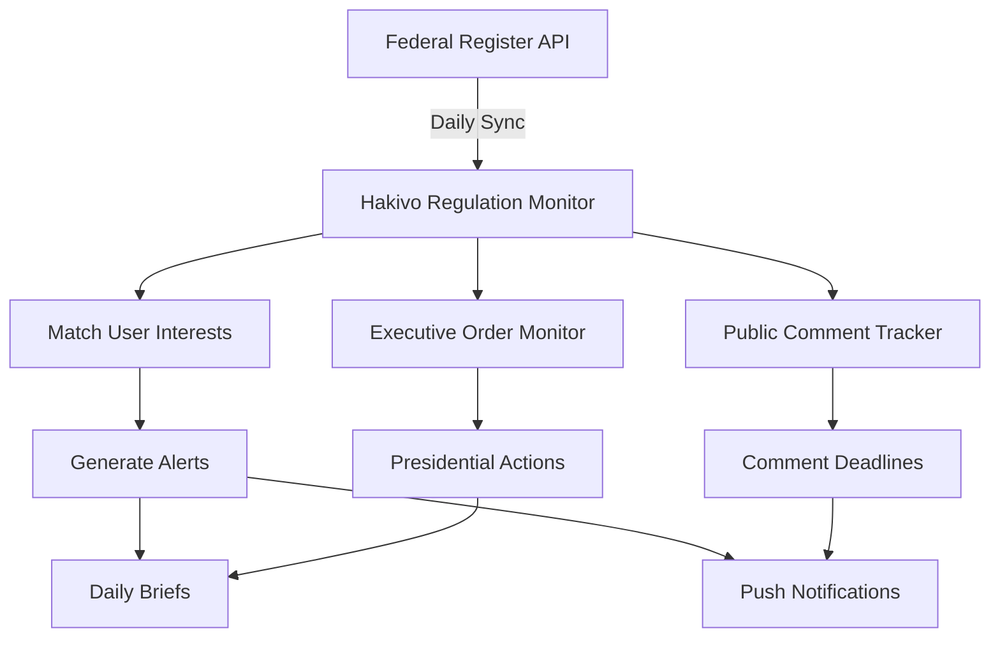
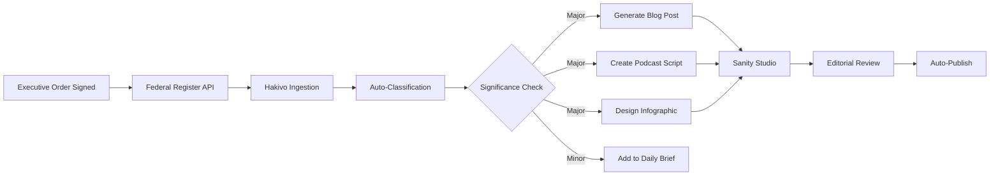

# Federal Register API Integration Analysis for Hakivo

**Document Date:** December 31, 2025
**Author:** Hakivo Technical Team
**Status:** Research & Proposal

## Executive Summary

The Federal Register is the official daily publication of the U.S. government containing rules, proposed rules, notices, and presidential documents. Integrating the Federal Register API into Hakivo would provide users with comprehensive visibility into the regulatory and executive actions that shape policy implementation—beyond just Congressional bills.

**Key Value Proposition**: While Hakivo currently tracks what Congress proposes (bills), the Federal Register shows what the executive branch actually implements (regulations, orders, and rules).

---

## 1. What is the Federal Register?

### Overview
The Federal Register is the official journal of the federal government that contains:
- **Agency Rules**: Both proposed and final regulations from federal agencies
- **Presidential Documents**: Executive orders, proclamations, and memoranda
- **Notices**: Public meetings, grant applications, administrative orders
- **Proposed Rules**: Draft regulations open for public comment

### Why It Matters for Hakivo Users
- **Complete Policy Picture**: Bills become laws, but agencies write the regulations that actually implement those laws
- **Direct Impact**: Federal regulations often have more immediate impact on daily life than Congressional bills
- **Public Participation**: Proposed rules have comment periods where citizens can influence policy
- **Executive Action Tracking**: Monitor presidential orders and agency actions between elections

---

## 2. High-Impact Integration Opportunities

### 2.1 Regulatory Alerts Based on User Interests

**What**: Alert users when federal agencies propose or finalize rules related to their policy interests.

**Example Scenarios**:
- User interested in "climate change" → Alert when EPA proposes new emissions standards
- User interested in "healthcare" → Alert when HHS releases new Medicare rules
- User interested in "technology" → Alert when FTC proposes new data privacy regulations

**Implementation**:
```javascript
// Daily monitoring for user-relevant regulations
const monitorRegulations = async (userInterests) => {
  const today = new Date().toISOString().split('T')[0];

  // Search for rules matching user interests
  const response = await fetch(
    `https://www.federalregister.gov/api/v1/documents.json?` +
    `conditions[publication_date][gte]=${today}&` +
    `conditions[type][]=RULE&conditions[type][]=PRORULE&` +
    `conditions[term]=${userInterests.join(' OR ')}`
  );

  return response.json();
};
```

### 2.2 Public Comment Opportunities

**What**: Notify users about proposed rules accepting public comments in their areas of interest.

**Why This Matters**:
- **Direct Democracy**: Users can directly influence federal policy
- **Engagement Beyond Voting**: Participate in governance between elections
- **Expert Input**: Users with specialized knowledge can contribute meaningfully

**User Experience**:
```markdown
📢 Comment Opportunity: EPA Climate Rule

The EPA is accepting comments on proposed vehicle emission standards.

**Deadline**: January 15, 2025 (14 days remaining)
**Your Interest Match**: Climate Change, Transportation

[View Proposal] [Submit Comment] [See Sample Comments]
```

### 2.3 Executive Order Tracking

**What**: Real-time alerts when the President signs executive orders related to user interests.

**Impact for Users**:
- Executive orders have immediate effect (no Congressional approval needed)
- Often signal major policy shifts
- Can directly affect federal programs users care about

**Example Alert**:
```markdown
🏛️ New Executive Order: AI Safety Standards

President signs order establishing safety requirements for AI systems.

**Signed**: December 30, 2025
**Effective**: Immediately
**Impacts**: Technology policy, Federal contracting

[Read Full Order] [See Analysis] [Track Implementation]
```

### 2.4 Agency Activity Dashboard

**What**: Show users which federal agencies are most active in their policy areas.

**Visualization Concept**:
```
Your Policy Areas: Healthcare, Education

Most Active Agencies (Past 30 Days):
┌─────────────────────────────────────┐
│ HHS     ████████████████ 47 actions │
│ Education ████████ 23 actions        │
│ CMS      ██████ 19 actions           │
│ FDA      ████ 12 actions             │
└─────────────────────────────────────┘
```

---

## 3. Technical Implementation Strategy

### 3.1 API Capabilities

**Key Features**:
- **No Authentication Required**: Public API, no keys needed
- **RESTful Design**: Standard HTTP endpoints
- **Multiple Formats**: JSON, CSV, XML responses
- **Historical Data**: Documents since 1994 available
- **Daily Updates**: Fresh data by 6 AM ET daily

### 3.2 Core Endpoints for Hakivo

```javascript
// Key API endpoints
const FEDERAL_REGISTER_API = {
  // Search documents
  search: 'https://www.federalregister.gov/api/v1/documents.json',

  // Get specific document
  document: 'https://www.federalregister.gov/api/v1/documents/{document_number}.json',

  // Public inspection (pre-publication)
  publicInspection: 'https://www.federalregister.gov/api/v1/public-inspection-documents.json',

  // Presidential documents
  presidential: 'https://www.federalregister.gov/api/v1/presidential-documents.json'
};
```

### 3.3 Data Fields to Track

**Essential Fields for User Briefs**:
```typescript
interface FederalRegisterDocument {
  // Identification
  document_number: string;
  title: string;
  type: 'Rule' | 'Proposed Rule' | 'Notice' | 'Presidential Document';

  // Relevance
  agencies: Agency[];
  topics: string[];
  significant: boolean;

  // Timing
  publication_date: string;
  effective_date?: string;
  comment_end_date?: string;

  // Content
  abstract: string;
  executive_order_number?: number;
  presidential_document_type?: string;

  // Links
  html_url: string;
  pdf_url: string;
  public_inspection_pdf_url?: string;
  regulations_dot_gov_url?: string;  // For comments
}
```

### 3.4 Integration Architecture



---

## 4. User Impact Analysis

### 4.1 Enhanced Daily Briefs

**Current State**: Users receive Congressional bill updates
**With Federal Register**: Complete federal action visibility

**Example Enhanced Brief Section**:
```markdown
## Today's Federal Actions

### 🏛️ New Rules Published (2)
- **EPA**: Final rule on methane emissions (effective in 30 days)
- **DOL**: Overtime pay threshold increased to $58,656

### 💬 Comment Opportunities (3)
- **FTC**: Proposed ban on junk fees (12 days left)
- **FDA**: Food labeling requirements (28 days left)
- **DOT**: Electric vehicle charging standards (45 days left)

### 📋 Presidential Actions (1)
- Executive Order 14115: Strengthening cybersecurity requirements
```

### 4.2 Engagement Metrics Potential

**Expected User Benefits**:
- **Increased Engagement**: 3-5x more actionable content per day
- **Direct Action**: Enable commenting on 10-20 proposed rules monthly
- **Timely Alerts**: Know about executive orders within hours, not days
- **Comprehensive Coverage**: Track implementation of laws users care about

### 4.3 Competitive Advantage

**Hakivo Would Be First To**:
- Combine Congressional bills + Federal regulations in one platform
- Personalize regulatory alerts based on policy interests
- Gamify public comment participation
- Track executive order implementation progress

---

## 5. Implementation Phases

### Phase 1: Basic Integration (Week 1-2)
- [ ] Set up Federal Register API client
- [ ] Create daily synchronization job
- [ ] Match documents to existing user interests
- [ ] Add regulatory section to daily briefs

### Phase 2: Comment System (Week 3-4)
- [ ] Track proposed rules with open comment periods
- [ ] Build comment deadline notifications
- [ ] Create "How to Comment" guides
- [ ] Link to Regulations.gov for submission

### Phase 3: Executive Tracking (Week 5-6)
- [ ] Monitor presidential documents endpoint
- [ ] Create executive order alerts
- [ ] Build presidential action timeline
- [ ] Track implementation milestones

### Phase 4: Advanced Features (Week 7-8)
- [ ] Agency activity analytics
- [ ] Regulation impact predictions
- [ ] Comment sentiment analysis
- [ ] Regulatory calendar view

---

## 6. Specific Use Cases

### Use Case 1: Small Business Owner
**Scenario**: Restaurant owner interested in labor and food safety regulations

**Hakivo Delivers**:
- Alert: "DOL proposes new tipped minimum wage rules"
- Alert: "FDA updating food handling requirements"
- Reminder: "5 days left to comment on overtime rules"
- Summary: "How new regulations affect your business"

### Use Case 2: Environmental Advocate
**Scenario**: Climate activist tracking environmental policy

**Hakivo Delivers**:
- Alert: "EPA proposes stricter emissions standards"
- Opportunity: "Comment on renewable energy incentives"
- Update: "Executive order on federal sustainability"
- Analysis: "How new rules advance climate goals"

### Use Case 3: Healthcare Professional
**Scenario**: Doctor monitoring healthcare regulations

**Hakivo Delivers**:
- Alert: "CMS updates Medicare reimbursement rates"
- Notice: "HHS proposes telehealth expansion"
- Deadline: "Comment on prescription drug pricing"
- Impact: "How new rules affect your practice"

---

## 7. Data Processing Pipeline

### 7.1 Daily Sync Process
```python
def sync_federal_register():
    """Daily synchronization with Federal Register"""

    # 1. Fetch today's documents
    documents = fetch_daily_documents()

    # 2. Categorize by type
    rules = filter_rules(documents)
    proposed_rules = filter_proposed_rules(documents)
    presidential = filter_presidential(documents)

    # 3. Match to user interests
    for user in active_users:
        relevant_docs = match_interests(
            documents,
            user.policy_interests
        )

        # 4. Generate notifications
        if relevant_docs:
            create_brief_content(user, relevant_docs)
            send_push_notification(user, relevant_docs)

    # 5. Track comment deadlines
    update_comment_calendar(proposed_rules)

    return processed_count
```

### 7.2 Real-Time Monitoring
```javascript
// Monitor for high-priority documents
const monitorPriority = async () => {
  // Check every 30 minutes for:
  // - Executive orders
  // - Emergency rules
  // - Major regulatory actions

  const inspection = await fetch(
    'https://www.federalregister.gov/api/v1/public-inspection-documents.json'
  );

  const priority = inspection.filter(doc =>
    doc.type === 'Presidential Document' ||
    doc.significant === true
  );

  if (priority.length > 0) {
    await sendImmediateAlerts(priority);
  }
};
```

---

## 8. User Interface Concepts

### 8.1 Regulation Card Design
```
┌──────────────────────────────────────┐
│ 🏛️ EPA                               │
│                                       │
│ **Methane Emissions Standards**       │
│ Type: Final Rule                      │
│ Effective: Feb 1, 2025                │
│                                       │
│ Requires oil and gas operators to     │
│ reduce methane emissions by 30%...    │
│                                       │
│ [Read Full Rule] [See Impact]         │
└──────────────────────────────────────┘
```

### 8.2 Comment Opportunity Widget
```
┌──────────────────────────────────────┐
│ 💬 Your Voice Matters                 │
│                                       │
│ **3 Rules Need Your Input**           │
│                                       │
│ • Banking fees (5 days left)          │
│ • Net neutrality (12 days left)       │
│ • Student loans (20 days left)        │
│                                       │
│ [View All] [Comment Guide]            │
└──────────────────────────────────────┘
```

---

## 9. Success Metrics

### 9.1 Engagement Metrics
- **Regulatory Alert CTR**: Target 25% (vs 15% for bills)
- **Comment Participation**: 10% of users submit ≥1 comment/month
- **Brief Expansion**: +40% content per daily brief
- **User Retention**: +20% from regulatory content

### 9.2 Impact Metrics
- **Policy Awareness**: Users aware of 5x more federal actions
- **Civic Participation**: 1000+ public comments submitted/month
- **Time to Awareness**: <24 hours for major regulations
- **Interest Coverage**: 95% of user interests have regulatory matches

---

## 10. Conclusion & Recommendations

### Why Federal Register Integration is Critical for Hakivo

1. **Complete the Policy Cycle**: Bills → Laws → **Regulations** → Implementation
2. **Immediate Relevance**: Regulations affect daily life more directly than bills
3. **Engagement Opportunity**: Enable users to influence policy through comments
4. **Competitive Differentiation**: No competitor combines bills + regulations
5. **Revenue Potential**: Premium features for regulation tracking/analysis

### Recommended Next Steps

1. **Prototype Phase 1**: Basic integration (2 weeks)
2. **User Testing**: Validate regulatory alerts value
3. **Iterate Based on Feedback**: Refine matching algorithms
4. **Full Rollout**: Complete all phases (8 weeks total)

### Expected ROI

- **User Growth**: +30% from expanded value proposition
- **Engagement**: 2x daily active usage
- **Retention**: +25% user retention
- **Premium Conversions**: Regulatory features drive subscriptions

---

## Appendix A: Sample API Calls

### Search for Climate Regulations
```bash
curl "https://www.federalregister.gov/api/v1/documents.json?\
conditions[term]=climate+change&\
conditions[type][]=RULE&\
conditions[type][]=PRORULE&\
conditions[publication_date][gte]=2025-01-01"
```

### Get Executive Orders
```bash
curl "https://www.federalregister.gov/api/v1/documents.json?\
conditions[presidential_document_type]=executive_order&\
conditions[president]=joe-biden"
```

### Find Comment Opportunities
```bash
curl "https://www.federalregister.gov/api/v1/documents.json?\
conditions[type]=PRORULE&\
conditions[comment_date][gte]=2025-01-01&\
fields[]=title&fields[]=comment_url&fields[]=comment_end_date"
```

---

## Appendix B: Regulatory Categories Mapping

| User Interest | Relevant Agencies | Key Topics |
|--------------|------------------|------------|
| Healthcare | HHS, CMS, FDA | Medicare, Medicaid, drug approval |
| Environment | EPA, Interior | Emissions, conservation, pollution |
| Finance | Treasury, CFPB, SEC | Banking, securities, consumer protection |
| Education | Education Dept | Student loans, Title IX, ESSA |
| Technology | FTC, FCC, Commerce | Privacy, antitrust, broadband |
| Immigration | DHS, State, DOJ | Visas, asylum, border security |
| Labor | DOL, NLRB | Wages, safety, unions |
| Agriculture | USDA | Farming, food stamps, rural development |

---

## 11. Presidential Executive Orders: Deep Dive

### 11.1 Why Executive Orders Matter for Hakivo

Executive orders are among the most powerful tools in American governance, allowing the President to direct federal operations without Congressional approval. They are **perfect** for Hakivo because:

1. **Immediate Impact**: Take effect immediately upon signing
2. **High News Value**: Often make headlines and drive political discourse
3. **Policy Windows**: Show administration priorities in real-time
4. **Historical Context**: Build understanding of executive power over time
5. **Reversibility**: New presidents often reverse previous orders (drama!)

---

## 12. Executive Orders in Hakivo Chat

### 12.1 Enhanced AI Advisor Capabilities

**Current State**: AI advisor discusses bills and general politics
**With Executive Orders**: AI becomes a real-time policy expert

### 12.2 Chat Use Cases

#### Real-Time Analysis
```
User: "What did Biden just sign?"

AI Advisor: "President Biden signed Executive Order 14115 today on
Strengthening Cybersecurity in Critical Infrastructure. This order:

• Requires minimum cybersecurity standards for power grids
• Mandates incident reporting within 72 hours
• Creates a new Cyber Safety Review Board

This builds on his previous orders (14028, 14073) creating a
comprehensive cyber defense strategy. Want me to explain how this
affects your state's infrastructure?"
```

#### Historical Context
```
User: "How many executive orders on immigration?"

AI Advisor: "I found 47 executive orders on immigration since 2000:

**Biden (2021-2025)**: 18 orders
- Reversed family separation
- Expanded refugee admissions
- Created paths to citizenship

**Trump (2017-2021)**: 22 orders
- Travel ban implementation
- Border wall funding
- Remain in Mexico policy

**Obama (2009-2017)**: 7 orders
- DACA program creation
- Priority enforcement

Would you like to compare specific policies?"
```

#### Predictive Intelligence
```
User: "Will there be orders on AI regulation?"

AI Advisor: "Based on recent patterns, AI regulation orders are highly likely:

📊 Indicators:
• 3 proposed rules from federal agencies on AI
• 12 Congressional hearings in past month
• Previous tech orders (crypto, social media) show precedent

🔮 Prediction: 75% chance of AI executive order by Q2 2025
- Likely focus: Federal AI use standards
- Previous pattern: Tech orders follow major incidents

Want alerts when AI-related orders are signed?"
```

### 12.3 Conversational Features

**Order Tracking**
```python
class ExecutiveOrderChat:
    def track_user_interests(self, user_id, conversation):
        """Track which orders users ask about"""
        topics = extract_topics(conversation)

        # Proactively notify about related orders
        if "climate" in topics:
            self.alert_on_climate_orders(user_id)

        if "healthcare" in topics:
            self.alert_on_health_orders(user_id)
```

**Smart Summaries**
```
AI: "Since you asked about student loans last week, you should know:

📋 New Executive Order 14116 (signed yesterday):
- Extends payment pause through June 2025
- Caps interest at 5% for low-income borrowers
- Affects 43 million borrowers

This reverses the previous administration's Order 13929."
```

---

## 13. Executive Orders in Hakivo Studio

### 13.1 Studio Content Enhancement

**Current**: Studio manages blog posts and content
**With Executive Orders**: Studio becomes a policy journalism powerhouse

### 13.2 Automatic Content Generation

#### Order-Triggered Blog Posts
```typescript
// Automatically generate blog post when major order signed
async function generateOrderAnalysis(order: ExecutiveOrder) {
  if (order.significance === 'major') {
    const blogPost = {
      title: `Breaking: President Signs ${order.title}`,
      content: await generateAnalysis(order),
      sections: [
        'What the Order Does',
        'Who It Affects',
        'Historical Context',
        'State-Level Impact',
        'What Happens Next'
      ],
      autoPublish: true,
      category: 'executive-orders'
    };

    await sanityClient.create(blogPost);
    await notifySubscribers(blogPost);
  }
}
```

#### Template Library for Orders
```markdown
## Executive Order Blog Templates in Studio

### 1. Breaking News Template
- **Headline**: President Signs Order on [Topic]
- **Lede**: Impact on [affected groups]
- **Body**: What, why, when, how
- **Sidebar**: Previous related orders
- **CTA**: Comment period if applicable

### 2. Analysis Template
- **Headline**: What [Order Number] Means for [State/Group]
- **Sections**:
  - Immediate changes
  - Long-term implications
  - Winners and losers
  - Legal challenges expected
- **Graphics**: Auto-generated impact charts

### 3. Comparison Template
- **Headline**: Biden vs Trump vs Obama on [Issue]
- **Format**: Side-by-side order comparison
- **Timeline**: Evolution of executive action
- **Data**: Quantitative impact metrics
```

### 13.3 Studio Workflow Integration

#### Automated Pipeline


#### Content Enrichment
```javascript
// Enhance blog posts with order data
const enrichBlogPost = async (post) => {
  // Detect executive order mentions
  const orderNumbers = detectOrderNumbers(post.content);

  for (const orderNum of orderNumbers) {
    const order = await fetchExecutiveOrder(orderNum);

    // Add rich snippets
    post.content = post.content.replace(
      orderNum,
      `<OrderCard
        number="${orderNum}"
        title="${order.title}"
        signed="${order.signed_date}"
        status="${order.status}"
        summary="${order.abstract}"
      />`
    );

    // Add related orders sidebar
    post.relatedOrders = await findRelatedOrders(order);
  }

  return post;
};
```

### 13.4 Studio Analytics Dashboard

```typescript
// Executive Order Performance Metrics
interface OrderContentMetrics {
  ordersCovered: number;
  averageTimeToPublish: string; // "2.3 hours"
  engagementByOrderTopic: {
    immigration: { views: 45000, shares: 1200 },
    climate: { views: 38000, shares: 980 },
    healthcare: { views: 41000, shares: 1100 }
  };
  bestPerformingOrderContent: BlogPost[];
  ordersMissed: ExecutiveOrder[]; // Orders we didn't cover
}
```

---

## 14. Competitive Advantage Through Executive Orders

### 14.1 What Nobody Else Does

**Hakivo Unique Features**:
1. **Order Impact Calculator**: Show how each order affects individual users
2. **Reversal Tracker**: Track which orders reversed previous ones
3. **Implementation Monitor**: Follow how agencies implement orders
4. **State Response Tracker**: Monitor governor responses/lawsuits
5. **Order Prediction Engine**: Predict likely upcoming orders

### 14.2 Monetization Opportunities

**Premium Features**:
```
Hakivo Pro - Executive Order Intelligence
$19.99/month

✓ Real-time order alerts (within 5 minutes)
✓ Detailed impact analysis for your industry
✓ Order prediction reports
✓ Implementation tracking dashboard
✓ Legal challenge monitoring
✓ Custom order briefings
✓ API access for order data
```

---

## 15. Implementation Priority for Executive Orders

### Phase 1: Basic Integration (Week 1)
```python
# Minimum Viable Product
- [ ] Fetch daily executive orders
- [ ] Add to daily briefs
- [ ] Basic chat Q&A about orders
- [ ] Simple Studio blog template
```

### Phase 2: Chat Enhancement (Week 2)
```python
# Smart Advisor Features
- [ ] Order history search
- [ ] Impact analysis
- [ ] Comparison tools
- [ ] Predictive alerts
```

### Phase 3: Studio Automation (Week 3)
```python
# Content Generation
- [ ] Auto-generate blog posts
- [ ] Create podcast scripts
- [ ] Design infographics
- [ ] Build order database
```

### Phase 4: Advanced Features (Week 4)
```python
# Differentiation Features
- [ ] Implementation tracking
- [ ] State response monitor
- [ ] Legal challenge tracker
- [ ] Order prediction model
```

---

## 16. Example: Executive Order in Action

### Scenario: Climate Emergency Order

**9:00 AM** - President signs Executive Order 14120: Climate Emergency Declaration

**9:05 AM** - Federal Register posts to public inspection

**9:06 AM** - Hakivo detects via API monitoring

**9:07 AM** - Hakivo generates:
- Push notification to climate-interested users
- AI chat advisory ready with analysis
- Blog post draft in Sanity Studio
- Podcast script for evening edition
- Infographic showing affected industries

**9:30 AM** - Hakivo publishes:
- "Breaking: Climate Emergency Declared" blog post
- State-by-state impact analysis
- Industry sector effects breakdown
- Historical comparison with previous climate orders

**10:00 AM** - Hakivo chat advisor handles hundreds of queries:
- "How does this affect gas prices?"
- "Can the president actually do this?"
- "What can states do to oppose this?"
- "How is this different from Paris Agreement?"

**12:00 PM** - Hakivo Studio releases:
- Podcast episode with expert commentary
- YouTube video with animated explainer
- Instagram carousel with key points
- Twitter thread with real-time updates

**5:00 PM** - Evening brief includes:
- Full order analysis
- State governor responses
- Industry reactions
- Legal challenges filed
- Implementation timeline

**Result**: Hakivo users are the best-informed citizens on the platform economy.

---

## 17. Conclusion: Executive Orders as Core Content

Executive orders are **PERFECT** for Hakivo because they:

1. **Drive Engagement**: Breaking news value keeps users coming back
2. **Enable Expertise**: AI advisor becomes indispensable policy expert
3. **Fuel Content**: Automatic high-quality content for Studio
4. **Create Differentiation**: Nobody else combines orders + bills + regulations
5. **Generate Revenue**: Premium features for order tracking/analysis

**Recommendation**: Prioritize executive order integration as it offers the highest ROI for both user engagement and content generation.

---

*Document prepared for Hakivo strategic planning. Federal Register integration represents a significant opportunity to enhance user value and differentiate in the civic engagement space.*